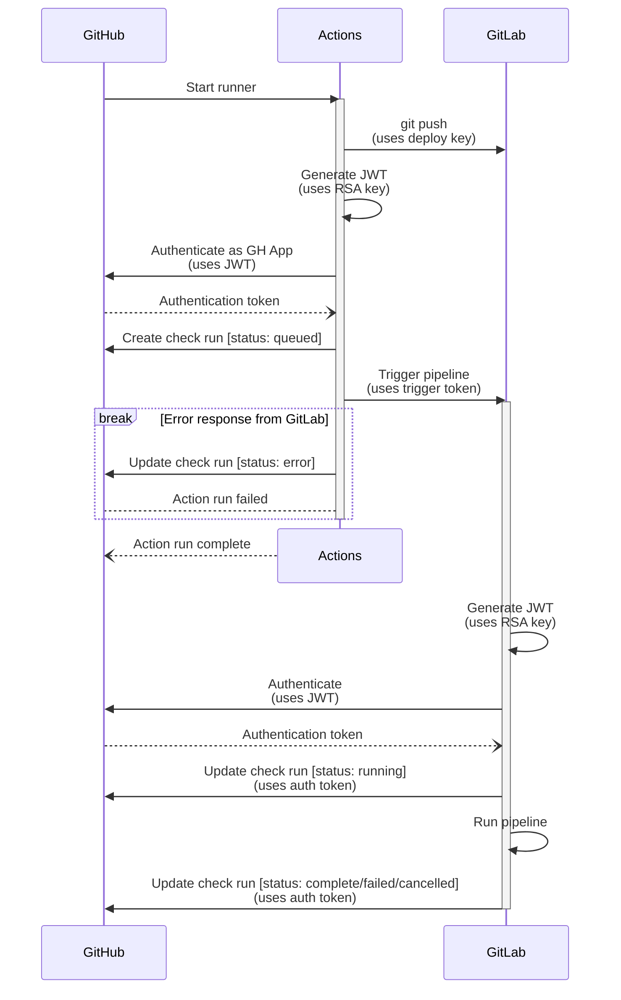

# Deployment notes and information
> [!NOTE]
> This is **not** documentation about how to deploy Elaastic on your own. For this, please refer
> to [this resource](https://github.com/user-attachments/assets/f44b240e-e48c-4232-a923-c1a2eef84f08). 😉

This document contains information about the deployment procedure in place. It also explains the reason behind the
current setup and the limitations that need to be taken into account while working on the CI/CD pipeline.

> [!IMPORTANT]
> This document also lists all the private cryptographic material involved in the CI/CD bridge. It is very important
> that it is **kept up to date**, to know where to look if configuration needs to change.
>
> If you're here because someone broke into the infrastructure, see [how to respond in case of an emergency](#emergency-safety-procedure).

## Context

### Restricted access
Due to security policies in place, access to the server is tightly controlled and only possible from authorized
terminals on the same network, and to the staff via an authenticated secure channel. IOW, it is not possible to
establish a direct connection to the machines via GitHub-hosted runners.

We do however have a GitLab CI/CD runner with the required clearance that can connect to the target machines and
perform automated deployment.

As a workaround, we leverage it to perform the last-mile delivery to the staging and production environments.

### GitLab synchronization
Pull-based mirroring is only available to GitLab Premium subscribers, which we are not. To circumvent this, we've
set things up so whenever we need to run a job on the GitLab CI/CD runner, we first push to the GitLab repository
and then triggers a [Multi-project downstream pipeline] via the [GitLab Pipeline Trigger API].

The GitLab pipeline is configured to report back to GitHub through the [GitHub Check Runs API] to avoid fragmented
CI/CD status.

### Remote environment
The deployment pipeline of the project is not entirely capable of deploying *from scratch* and assumes the remote
servers have been configured beforehand.

This baseline is shared across multiple projects under the Elaastic umbrella and is tracked in the private
[Elaastic Ops] repository on the IRIT GitLab server.

## Deployment
> [!NOTE]
> Because of the restrictions mentioned [earlier in the context section](#context), there is a whole setup to bridge
> GitHub Actions with the GitLab CI/CD runner at IRIT. This is documented separately in [§ CI/CD bridge].

### Inventory
Below is an exhaustive list of private and public information used in the deployment configuration.
All those are saved in [GitLab IRIT CI/CD variables].

All values are distinct between environments. A job deploying to staging will receive the hostname(s) for staging
targets as well as staging private keys, but not production ones.

> [!NOTE]
> Private and public information used within the CI/CD bridge setup are documented separately. See [§ CI/CD bridge]

- 🔐 | Indicates a **private** value. There must be securely handled and stored.
- 🔓 | Indicates a **public** key. These must be deleted **immediately** if the corresponding private key is compromised.
- 🗝️ | Indicates a **symmetric** key. There must be securely handled *and* immediately deleted if compromised.
- If there's no symbol, then it's a boring value that just exists for the sake of not hardcoding values.

> [!TIP]
> See [§ Appendix A] for storing private keys, certificates, and other PEM-formatted information as a GitLab hidden secret.

- `SSH_HOST`: Host to deploy onto. The deployment pipeline will connect to it over SSH.

- `SSH_PORT`: SSH port to connect on.

- `SSH_USER`: User to connect as.

- 🔓 `SSH_PINNED_HOST_KEY` - Public key of target SSH server. Pinned to detect and prevent MITM attacks.
  - Available in `/etc/ssh/ssh_host_ed25519_key.pub` on the target server.
  - *Should be provisioned by the baseline Ansible job in the future.*

- 🔐 `SSH_PRIVATE_KEY`: **Private** SSH key (Ed25519) - Authenticates the deployment job to the target server over SSH.
  - Production key
    - Public key: `ssh-ed25519 AAAAC3NzaC1lZDI1NTE5AAAAILdo6t7d0GmsgHda6nO/tXhqMObodXf/g+k4cMskfJcq Elaastic deploy user (Production)`
    - Generated by `Cynthia Rey` on `2025-10-29 16:32:00 CET`
      - Generated on a persistent storage (SSD with full-disk encryption)
      - Own copy deleted on `2025-10-29 16:37:00 CET`
    - Saved in [GitLab IRIT CI/CD variables] on `2025-10-27 16:34:00 CET`
    - Public key used in:
      - `~/.ssh/authorized_keys` file of the user account used to deploy (see `SSH_USER`).

  - Staging key
    - Public key: `ssh-ed25519 AAAAC3NzaC1lZDI1NTE5AAAAICRk2xD1rPhKWCy/dcvGp9sAepgUBa86se3O1DXp66i/ Elaastic deploy user (Staging)`
    - Generated by `Cynthia Rey` on `2025-10-29 16:31:00 CET`
      - Generated on a persistent storage (SSD with full-disk encryption)
      - Own copy deleted on `2025-10-29 16:37:00 CET`
    - Saved in [GitLab IRIT CI/CD variables] on `2025-10-27 16:35:00 CET`
    - Public key used in:
      - `~/.ssh/authorized_keys` file of the user account used to deploy (see `SSH_USER`).

## CI/CD bridge
### Overview


### Inventory
Below is an exhaustive list of private and public information used in the CI/CD bridge system.

- 🔐 | Indicates a **private** value. There must be securely handled and stored.
- 🔓 | Indicates a **public** key. These must be deleted **immediately** if the corresponding private key is compromised.
- 🗝️ | Indicates a **symmetric** key. There must be securely handled *and* immediately deleted if compromised.
- If there's no symbol, then it's a boring value that just exists for the sake of not hardcoding values.

#### GitHub Actions
Private information is stored as [GitHub Actions secrets], while public information is stored as [GitHub Actions variables].

- 🔐 `GITLAB_CI_DEPLOY_KEY`: **Private** SSH key (Ed25519) - Authenticates the GHA job to GitLab over SSH.
  - Public key: `ssh-ed25519 AAAAC3NzaC1lZDI1NTE5AAAAIFQy8baVVo5xzy7ZmqFvAe/aMAPqT29jR9WbPEeE4GI+ GitHub Actions`
  - Generated by `Cynthia Rey` on `2025-10-22 17:14:00 CEST`
    - Generated on a persistent storage (SSD with full-disk encryption)
    - Own copy deleted on `2025-10-23 12:07:00 CEST`
  - Saved in [GitHub Actions secrets] on `2025-10-23 12:01:00 CEST`
  - Public key used in:
    - [GitLab IRIT (Deploy keys)] (see [§ GitLab CI/CD](#gitlab-cicd))

- 🗝️ `GITLAB_CI_TRIGGER_TOKEN`: **Token** - Allows the GHA job to start the GitLab CI/CD pipeline.
  - Provided by [`GitLab IRIT (Pipeline trigger token)`] to `Cynthia Rey` on `2025-10-22 17:09:00 CEST`
    - Token was not saved to a persistent storage
  - Saved in [GitHub Actions secrets] on `2025-10-22 17:10:00 CEST`
  - Token also used in:
    - [GitLab IRIT CI/CD variables] (see [§ GitLab CI/CD](#gitlab-cicd))

- 🔐 `REMOTE_CI_APP_PRIVATE_KEY`: **Private** RSA key - Authenticates as a GitHub App to manage check runs.
  - Provided by [`GitHub Apps`] to `John Tranier` on `2025-10-27 14:00:00 CET`
  - Public key managed by [GitHub Apps] and not use anywhere else

- `GITLAB_HOST`: Hostname where the GitLab server is.

- 🔓 `GITLAB_HOST_PUBKEY`: Public key of GitLab's SSH server. Pinned to detect and prevent MITM attacks.
  - Private key managed by IRIT itself.
  - ~Cynthia: getting it is kind of a pain, I personally fished it out of my own's known_hosts file... pick the ed25519 one.

- `GITLAB_PROJECT_ID`: ID of the project used as a mirror to run the CI on. Visible in general project settings.

- `GITLAB_PROJECT_PATH`: Path to the repository (`<group>/[subgroups...]/<repo>`) on GitLab.

- `REMOTE_CI_APP_CLIENT_ID`: Client ID of the GitHub App owned by the Elaastic org.
  - Must match the value set in [GitLab IRIT CI/CD variables]. See [§ GitLab CI/CD](#gitlab-cicd)

- `REMOTE_CI_APP_INSTALL_ID`: Installation ID of the GitHub App inside the org.
  - Must match the value set in [GitLab IRIT CI/CD variables]. See [§ GitLab CI/CD](#gitlab-cicd)
  - See https://stackoverflow.com/a/74474953/13154480

#### GitLab CI/CD
> [!TIP]
> See [§ Appendix A] for storing private keys, certificates, and other PEM-formatted information as a GitLab hidden secret.

- 🔓 `GITLAB_CI_DEPLOY_KEY`: Public SSH key (Ed25519) - Authenticates the GHA job to GitLab over SSH.
  - Public key counterpart of the private key stored in [GitHub Actions secrets]. See [§ GitHub Actions](#github-actions)

- 🗝️ `GITLAB_CI_TRIGGER_TOKEN`: **Token** - Allows the GHA job to start the GitLab CI/CD pipeline.
  - Generated (and managed) by [`GitLab IRIT (Pipeline trigger token)`] on `2025-10-22 17:09:00 CEST`
  - Token also used in:
    - [GitHub Actions secrets] (see [§ GitHub Actions](#github-actions))

- 🔐 `REMOTE_CI_APP_PRIVATE_KEY`: **Private** RSA key - Authenticates as a GitHub App to manage check runs.
  - Provided by [`GitHub Apps`] to `John Tranier` on `2025-10-27 14:00:00 CET`
  - Saved in [GitLab IRIT CI/CD variables] on `2025-10-27 16:28:00 CET`
  - Public key managed by [GitHub Apps] and not use anywhere else.

- `GITHUB_REPOSITORY`: Path of the repository (`<owner>/<repo>`) on GitHub.

- `REMOTE_CI_APP_CLIENT_ID`: Client ID of the GitHub App owned by the Elaastic org.
  - Must match the value set in [GitHub Actions variables]. See [§ GitHub Actions](#github-actions)

- `REMOTE_CI_APP_INSTALL_ID`: Installation ID of the GitHub App inside the org.
  - Must match the value set in [GitLab IRIT CI/CD variables]. See [§ GitLab CI/CD](#gitlab-cicd)
  - See https://stackoverflow.com/a/74474953/13154480

### Emergency safety procedure
In case of an emergency, the **first** steps must be to contain the incident, then report it to whom it may concern.
All credentials should then be revoked in order of importance. Reprovision should only begin once enough information is
known to confirm that the root cause has been mitigated.

The strongly recommended line of action is as follows:

1. Revoke all the [Pipeline trigger tokens on IRIT's GitLab repo][GitLab IRIT (Pipeline trigger token)].
2. Revoke all the [Deploy keys on IRIT's GitLab repo][GitLab IRIT (Deploy keys)].
3. **Shut down** the servers the CI/CD had access to.
4. [Report the incident according to IRIT procedures][sec-event-irit-intranet].
   The machines used to deploy should only be kept for investigation purposes, and completely wiped clean.
   A backup dated prior the date of the root incident should be used for the database.
5. Invalidate **all** credentials that were stored in [GitHub Actions secrets], and in [GitLab IRIT CI/CD variables].

## Appendix A: Storing PEM as a hidden secret in GitLab
Because of restrictions in GitLab about masked variables, it's not possible to store the raw key as easily as in
GitHub Actions secrets. Below is the workaround used to save the keys in a way that pleases GitLab:

1. Remove the header and the footer (but keep them around, you'll need them later)
2. Remove all line breaks, so that the file contents are all on a single line
3. Store this long string as the variable
4. Rebuild the file within the pipeline

Here is a magic shell command that'll do the transformation for you, and the snippet to use within the CI script.

```sh
sed '1d;$d' [key_file] | tr -d '\r\n'
```
```yaml
script:
  - echo "[the header from step 1]"  > /tmp/my_secret_key.pem
  - echo "$THE_SECRET_VARIABLE"     >> /tmp/my_secret_key.pem
  - echo "[the footer from step 1]" >> /tmp/my_secret_key.pem
```

> [!CAUTION]
> IntelliJ loves to eat one of the dashes when pasting the header in the yaml spec.
> **Make sure there are exactly 5 dashes at the beginning of the header and the footer**.
>
> *Signed, a tired person who spent too much time troubleshooting a CI pipeline that was failing because of this.*

[Elaastic Ops]: https://gitlab.irit.fr/talent/TALENT/around-elaastic/elaastic-ops

[Multi-project downstream pipeline]: https://docs.gitlab.com/ci/pipelines/downstream_pipelines/#multi-project-pipelines
[GitLab Pipeline Trigger API]: https://docs.gitlab.com/api/pipeline_triggers/#trigger-a-pipeline-with-a-token
[GitHub Check Runs API]: https://docs.github.com/en/rest/checks/runs?apiVersion=2022-11-28

[GitHub Actions secrets]: https://github.com/elaastic/elaastic-questions-server/settings/secrets/actions
[GitHub Actions variables]: https://github.com/elaastic/elaastic-questions-server/settings/variables/actions
[GitLab IRIT CI/CD variables]: https://gitlab.irit.fr/talent/TALENT/around-elaastic/elasstic-questions-server/-/settings/ci_cd#js-pipeline-triggers

[GitHub Apps]: https://github.com/organizations/elaastic/settings/apps
[`GitHub Apps`]: https://github.com/organizations/elaastic/settings/apps

[GitLab IRIT (Deploy keys)]: https://github.com/organizations/elaastic/settings/apps
[`GitLab IRIT (Deploy keys)`]: https://github.com/organizations/elaastic/settings/ap

[GitLab IRIT (Pipeline trigger token)]: https://github.com/organizations/elaastic/settings/apps
[`GitLab IRIT (Pipeline trigger token)`]: https://github.com/organizations/elaastic/settings/ap

[§ Appendix A]: #appendix-a-storing-pem-as-a-hidden-secret-in-gitlab
[§ CI/CD bridge]: #cicd-bridge

[gl-irit-dk]: https://gitlab.irit.fr/talent/TALENT/around-elaastic/elasstic-questions-server/-/settings/repository#js-deploy-keys-settings
[gl-irit-ptt]: https://gitlab.irit.fr/talent/TALENT/around-elaastic/elasstic-questions-server/-/settings/ci_cd#js-pipeline-triggers
[sec-event-irit-intranet]: https://intranet.irit.fr/wiki/doku.php?id=sinfo:utilisateur:index&s[]=cssi#signaler_un_incident_de_securite
