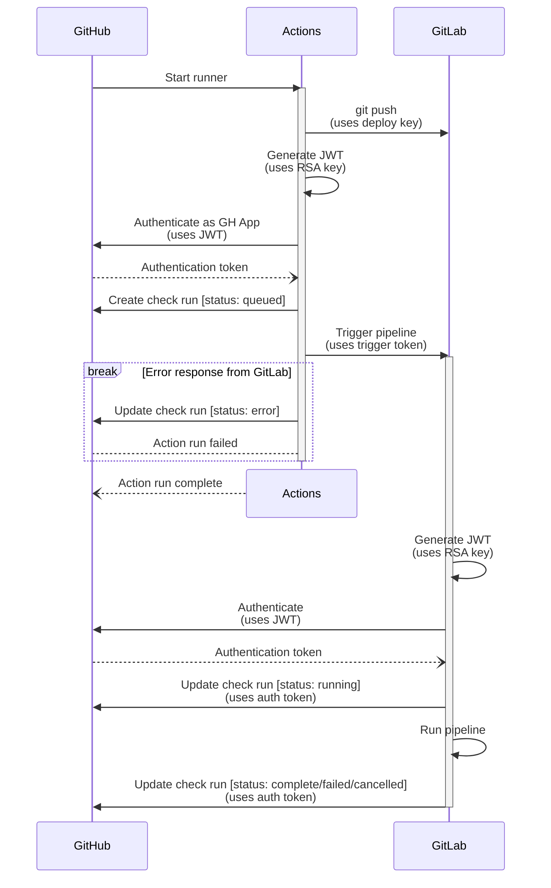

# Deployment notes and information
This document contains information about the deployment procedure in place. It also explains the reason behind the
current setup and the limitations that need to be taken into account while working on the CI/CD pipeline.

> [!IMPORTANT]
> This document also lists all the private cryptographic material involved in the CI/CD bridge. It is very important
> that it is **kept up to date**, to know where to look if configuration needs to change.

## Restricted access
Due to security policies in place, access to the server is tightly controlled and only possible from authorized
terminals on the same network, and to the staff via an authenticated secure channel. IOW, it is not possible to
establish a direct connection to the machines via GitHub-hosted runners.

We do however have a GitLab CI/CD runner with the required clearance that can connect to the target machines and
perform automated deployment.

As a workaround, we leverage it to perform the last-mile delivery to the staging and production environments.

## GitLab synchronization
Pull-based mirroring is only available to GitLab Premium subscribers, which we are not. To circumvent this, we've
set things up so whenever we need to run a job on the GitLab CI/CD runner, we first push to the GitLab repository
and then triggers a [Multi-project downstream pipeline] via the [GitLab Pipeline Trigger API].

The GitLab pipeline is configured to report back to GitHub through the [GitHub Statuses API] to avoid fragmented
CI/CD status.

## Remote environment
The deployment pipeline of the project is not entirely capable of deploying *from scratch* and assumes the remote
servers have been configured beforehand.

This baseline is shared across multiple projects under the Elaastic umbrella and is tracked in the private
[Elaastic Ops] repository on the IRIT GitLab server.

## CI/CD bridge
> [!CAUTION]
> This section must be kept up to date, so there is no private material in unattended circulation. Any leaked
> credential might compromise the pipeline integrity and must be promptly revoked.
> 
> See [how to respond in case of an emergency](#emergency-safety-procedure)

### Overview

### Inventory
Below is an exhaustive list of private and public information used in the CI/CD bridge system.

- 🔐 | Indicates a **private** value. There must be securely handled and stored.
- 🔓 | Indicates a **public** key. These must be deleted **immediately** if the corresponding private key is compromised.
- 🗝️ | Indicates a **symmetric** key. There must be securely handled *and* immediately deleted if compromised.
- If there's no symbol, then it's a boring value that just exists for the sake of not hardcoding values.

#### GitHub Actions
Private information is stored as [GitHub Actions secrets], while public information is stored as [GitHub Actions variables].

- 🔐 `GITLAB_CI_DEPLOY_KEY`: **Private** SSH key (Ed25519) - Authenticates the GHA job to GitLab over SSH.
  - Public key: `ssh-ed25519 AAAAC3NzaC1lZDI1NTE5AAAAIFQy8baVVo5xzy7ZmqFvAe/aMAPqT29jR9WbPEeE4GI+ GitHub Actions`
  - Generated by `Cynthia Rey` on `2025-10-22 17:14:00 CEST`
    - Generated on a persistent storage (SSD with full-disk encryption)
    - Own copy deleted on `2025-10-23 12:07:00 CEST`
  - Saved in [GitHub Actions secrets] on `2025-10-23 12:01:00 CEST`
  - Public key used in:
    - [GitLab IRIT (Deploy keys)][gl-irit-dk] (see [§ GitLab CI/CD](#gitlab-cicd))

- 🗝️ `GITLAB_CI_TRIGGER_TOKEN`: **Token** - Allows the GHA job to start the GitLab CI/CD pipeline.
  - Provided by [`GitLab IRIT (Pipeline trigger token)`][gl-irit-ptt] to `Cynthia Rey` on `2025-10-22 17:09:00 CEST`
    - Token was not saved to a persistent storage
  - Saved in [GitHub Actions secrets] on `2025-10-22 17:10:00 CEST`
  - Token also used in:
    - [GitLab IRIT CI/CD variables] (see [§ GitLab CI/CD](#gitlab-cicd))

- 🔐 `REMOTE_CI_APP_PRIVATE_KEY`: **Private** RSA key - Authenticates as a GitHub App to manage check runs.
  - Provided by [`GitHub Apps`][gh-apps] to `John Tranier` on `2025-10-27 14:00:00 CET`
  - Public key managed by [GitHub Apps][gh-apps] and not use anywhere else

- `GITLAB_HOST`: Hostname where the GitLab server is.

- 🔓 `GITLAB_HOST_PUBKEY`: Public key of GitLab's SSH server. Pinned to detect and prevent MITM attacks.
  - Private key managed by IRIT itself.
  - ~Cynthia: getting it is kind of a pain, I personally fished it out of my own's known_hosts file... pick the ed25519 one.

- `GITLAB_PROJECT_ID`: ID of the project used as a mirror to run the CI on. Visible in general project settings.

- `GITLAB_PROJECT_PATH`: Path to the repository (`<group>/[subgroups...]/<repo>`) on GitLab.

- `REMOTE_CI_APP_CLIENT_ID`: Client ID of the GitHub App owned by the Elaastic org.
  - Must match the value set in [GitLab IRIT CI/CD variables]. See [§ GitLab CI/CD](#gitlab-cicd)

- `REMOTE_CI_APP_INSTALL_ID`: Installation ID of the GitHub App inside the org.
  - Must match the value set in [GitLab IRIT CI/CD variables]. See [§ GitLab CI/CD](#gitlab-cicd)
  - See https://stackoverflow.com/a/74474953/13154480

#### GitLab CI/CD

- 🔓 `GITLAB_CI_DEPLOY_KEY`: Public SSH key (Ed25519) - Authenticates the GHA job to GitLab over SSH.
  - Public key counterpart of the one stored in [GitHub Actions]. See [§ GitHub Actions](#github-actions)

- 🗝️ `GITLAB_CI_TRIGGER_TOKEN`: **Token** - Allows the GHA job to start the GitLab CI/CD pipeline.
  - Generated (and managed) by [`GitLab IRIT (Pipeline trigger token)`][gl-irit-ptt] on `2025-10-22 17:09:00 CEST`
  - Token also used in:
    - [GitHub Actions secrets] (see [§ GitHub Actions](#github-actions))

- 🔐 `REMOTE_CI_APP_PRIVATE_KEY`: **Private** RSA key - Authenticates as a GitHub App to manage check runs.
  - Provided by [`GitHub Apps`][gh-apps] to `John Tranier` on `2025-10-27 14:00:00 CET`
  - Saved in [GitLab IRIT CI/CD variables] on `2025-10-27 16:28:00 CET`
  - Public key managed by [GitHub Apps][gh-apps] and not use anywhere else

- `GITHUB_REPOSITORY`: Path of the repository (`<owner>/<repo>`) on GitHub.

- `REMOTE_CI_APP_CLIENT_ID`: Client ID of the GitHub App owned by the Elaastic org.
  - Must match the value set in [GitHub Actions variables]. See [§ GitHub Actions](#github-actions)

- `REMOTE_CI_APP_INSTALL_ID`: Installation ID of the GitHub App inside the org.
  - Must match the value set in [GitLab IRIT CI/CD variables]. See [§ GitLab CI/CD](#gitlab-cicd)
  - See https://stackoverflow.com/a/74474953/13154480

### Emergency safety procedure
In case of an emergency, the **first** steps must be to contain the incident, then report it to whom it may concern.
All credentials should then be revoked in order of importance. Reprovision should only begin once enough information is
known to confirm that the root cause has been mitigated.

The strongly recommended line of action is as follows:

1. Revoke all the [Pipeline trigger tokens on IRIT's GitLab repo][gl-irit-ptt].
2. Revoke all the [Deploy keys on IRIT's GitLab repo][gl-irit-dk].
3. **Shut down** the servers the CI/CD had access to.
4. [Report the incident according to IRIT procedures][sec-event-irit-intranet].
   The machines used to deploy should only be kept for investigation purposes, and completely wiped clean.
   A backup dated prior the date of the root incident should be used for the database.
5. Invalidate **all** credentials that were stored in [GitHub Actions secrets], and in GitLab IRIT CI/CD configuration.

[Multi-project downstream pipeline]: https://docs.gitlab.com/ci/pipelines/downstream_pipelines/#multi-project-pipelines
[GitLab Pipeline Trigger API]: https://docs.gitlab.com/api/pipeline_triggers/#trigger-a-pipeline-with-a-token
[GitHub Statuses API]: https://docs.github.com/en/rest/commits/statuses?apiVersion=2022-11-28
[Elaastic Ops]: https://gitlab.irit.fr/talent/TALENT/around-elaastic/elaastic-ops

[GitHub Actions secrets]: https://github.com/elaastic/elaastic-questions-server/settings/secrets/actions
[GitHub Actions variables]: https://github.com/elaastic/elaastic-questions-server/settings/variables/actions
[GitLab IRIT CI/CD variables]: https://gitlab.irit.fr/talent/TALENT/around-elaastic/elasstic-questions-server/-/settings/ci_cd#js-pipeline-triggers

[gh-apps]: https://github.com/organizations/elaastic/settings/apps
[gl-irit-dk]: https://gitlab.irit.fr/talent/TALENT/around-elaastic/elasstic-questions-server/-/settings/repository#js-deploy-keys-settings
[gl-irit-ptt]: https://gitlab.irit.fr/talent/TALENT/around-elaastic/elasstic-questions-server/-/settings/ci_cd#js-pipeline-triggers
[sec-event-irit-intranet]: https://intranet.irit.fr/wiki/doku.php?id=sinfo:utilisateur:index&s[]=cssi#signaler_un_incident_de_securite
