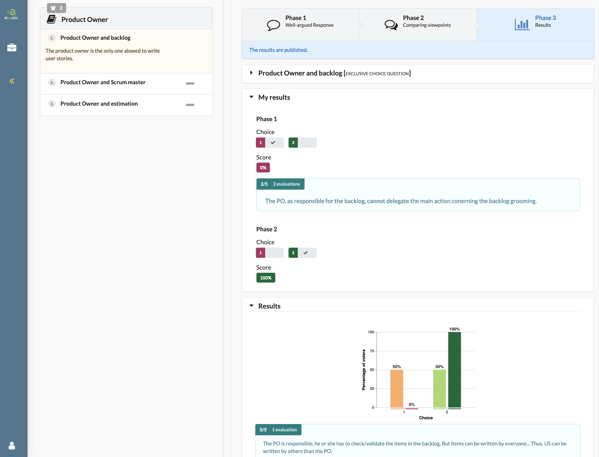

# Summary

`Elaastic` is a web-based application that allows teachers and students to implement formative assessment sequences in contexts (large groups of students, distance or hybrid learning) where these would be difficult to set up  without the help of technology.
The application implements different workflows depending on the context. These workflows allow: (1) the teacher to ask a choice or open-ended question to his/her group of students, (2) the students to answer the question by providing a written justification. The system then organises a peer review of the various contributions and processes all the data entered so that each student receives feedback on their answer presented by the system. The sequence then usually ends (face-to-face or hybrid context) with a discussion between teacher and students.  

# Statement of need

`Elaastic` has been developed in the context of research conducted by the [TALENT team at IRIT](https://www.irit.fr/en/departement/dep-interaction-collective-intelligence/talent-team/) on the design and implementation of formative assessment processes. Inspired by the work on Peer Instruction [@crouch2001peer:2001], we mobilise the technology to improve the formative assessment processes on different dimensions: context of use, interaction modalities, students engagement in complex tasks or even the improvement of feedbacks for online tests [@silvestre2017new:2017;silvestre2015reflexive:2015]. Finally, recently, we are using learning analytics on data collected since 2015 to elicit links between the different variables characterising a formative assessment sequence. We exploit the results to help teachers in their decision making during sequences orchestrated with `Elaastic`[andriamiseza2021vers:2021;@andriamiseza2021data:2021].

For all these research works, we use `Elaastic` to conduct our experiments in ecological contexts in different institutions of higher education and recently in secondary schools. Since 2015, the platform has been used by more than 50 teachers, with almost 3200 distinct students providing more than 12100 textual responses in the context of the activities orchestrated by `Elaastic`.

Since 2020, the `Elaastic` platform is [labelled by IRIT](https://www.irit.fr/en/plateformes/elaastic-platform/).  

# Acknowledgements

We acknowledge the French government which is currently funding the [B4MATIVE!](https://www.irit.fr/b4mative/) project in partnership with the Nancy-Metz Academy to actively pursue research work based on `Elaastic`.

# References
