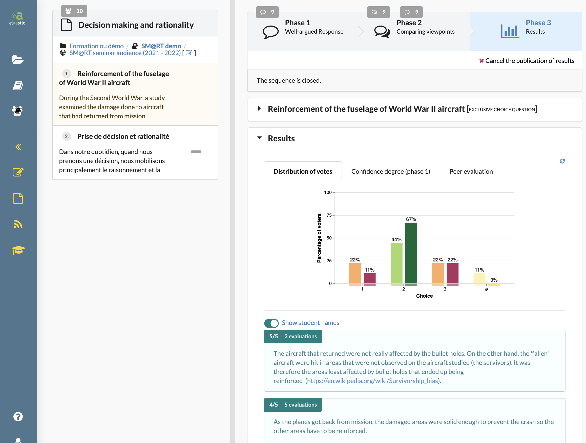
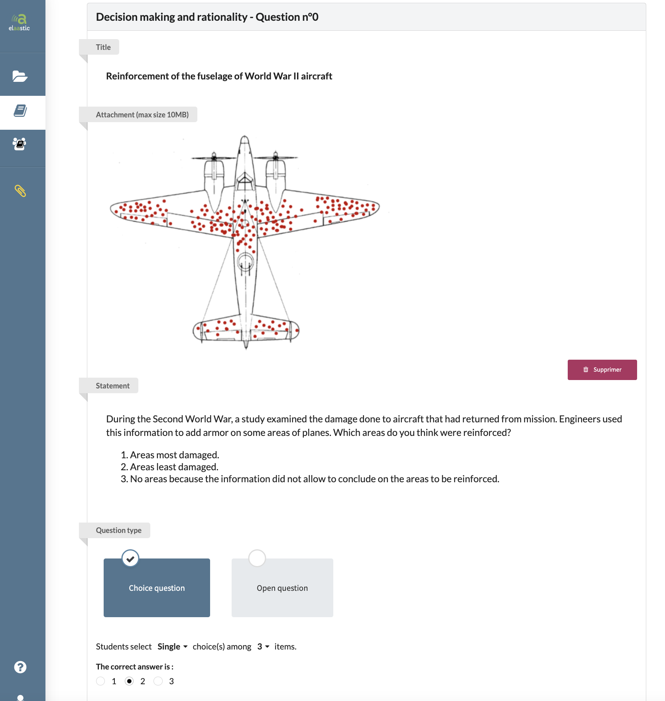
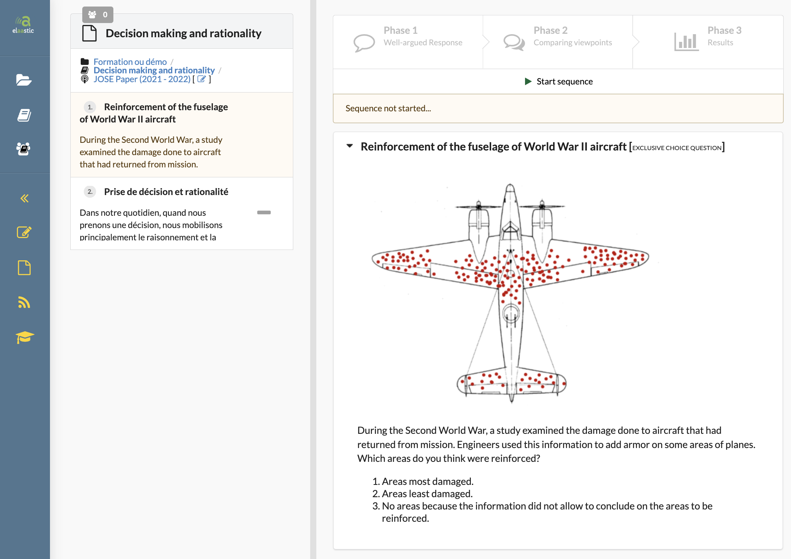
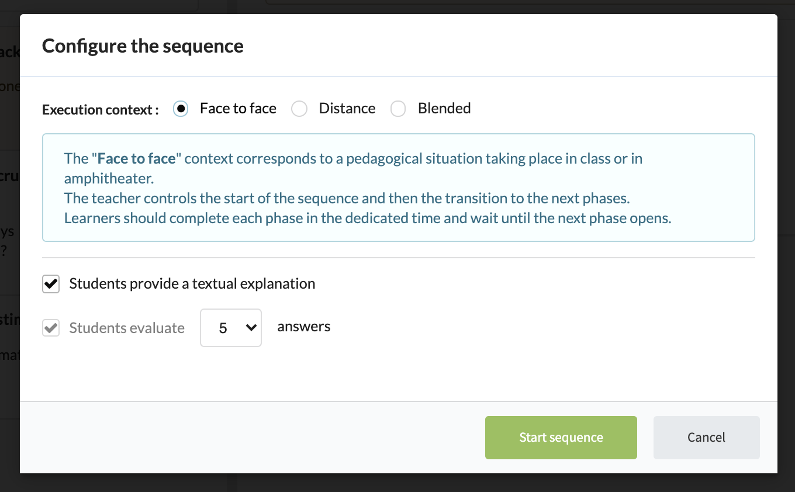
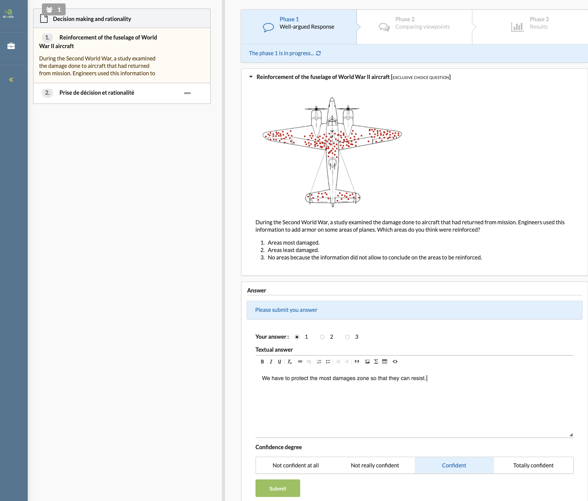
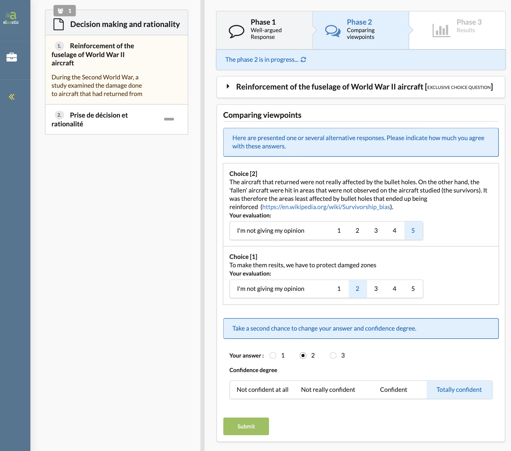
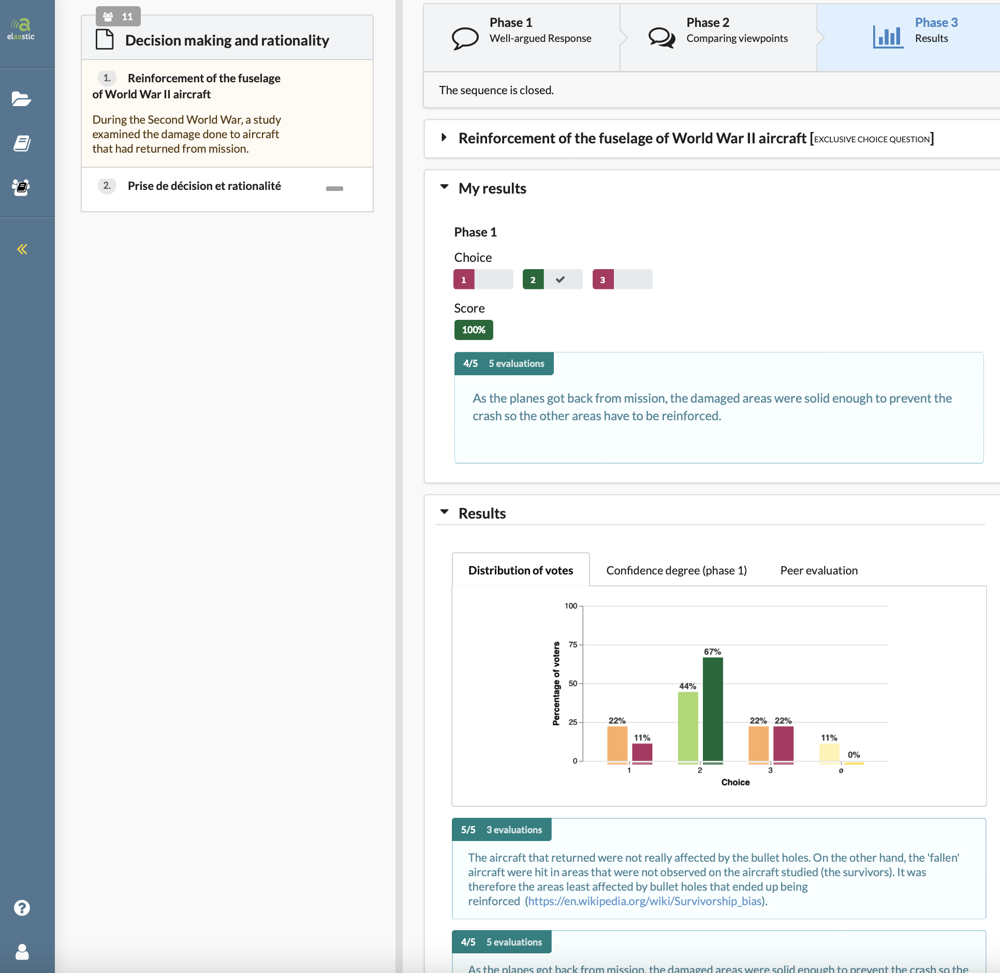

# Summary

[Elaastic](https://www.irit.fr/elaastic/) is a web-based application that allows teachers to implement formative assessment sequences 
with large groups of students, during face to face or distance courses.
The application implements different workflows depending on the learning context. These workflows consist of at least 4 phases : (1) the teacher to ask a choice or open-ended question to his/her group of students, (2) the students to answer the question by providing a written justification. The system then organises (3) a peer review of the various contributions and processes all the collected data so that (4) the teacher and each student receives feedback relative to the answers. The sequence then usually ends with a discussion between teacher and students based on the provided feedback (\autoref{fig:phase-3-teacher}).

# Statement of need

`Elaastic` and its ancestor `Tsaap-Notes`, have been developed in the context of research conducted by the 
[TALENT team at IRIT](https://www.irit.fr/en/departement/dep-interaction-collective-intelligence/talent-team/) on the design and implementation of formative assessment systems. First inspired by the Peer Instruction process [@crouch2001peer], we use technology to improve formative assessment processes on different dimensions: context of use, types of interactions or students engagement in complex tasks such as written argumentation [@silvestre2015conception]. The newly designed processes were also used to improve feedback in the online tests provided to students as revision tools. [@silvestre2017nouveau; @silvestre2015reflexive]. 
Finally, recently, we are using learning analytics on data collected since 2015 to elicit links between the different variables characterising a formative assessment sequence. We exploit the results to help teachers in their decision making during sequences orchestrated with `Elaastic` [@andriamiseza2021bdata; @andriamiseza2021arecomm; @andriamiseza2021cvers].

For all these research works, we use `Elaastic` to conduct experiments in ecological contexts in different 
institutions of higher education and recently in secondary schools. Between 2015 and 2021, the platform has been used by more than 60 teachers, with around 4800 distinct students providing more than 30000 textual responses in the context of the activities orchestrated by `Elaastic`.

# Main features

## As a teacher

`Elaastic` allows teacher to create assignments for students. An assignment is composed of several questions that can be 
of different types : exclusive choice, multiple choice or open-ended. \autoref{fig:update-question-teacher} presents the interface allowing 
the edition of a multiple-choice question.

When an assignment is ready to be played by students, the teacher can switch in the *player* mode to orchestrate sequences
based on assignment's questions. \autoref{fig:teacher-player} presents the interface of the player for the teacher. It contains 
action buttons allowing to start and stop the different phases of a sequence corresponding to a question.

When starting a sequence, the teachers configure the current sequence specifying the learning context and some other characteristics 
of the sequence as showed in \autoref{fig:sequence-configuration}. 

The teacher gives access to the assigment by providing a dedicated URL to his/her students or by creating an `Elaastic` activity in a Learning Tools Interoperability (LTI) compliant Learning Management System (LMS).

From the beginning to the end of the sequence, the teacher has an interface allowing him/her to follow the progress and productions of the learners (\autoref{fig:phase-3-teacher}).

## As a learner

`Elaastic` allows students to register an assignment by clicking a dedicated URL or an 
activity link in a learning management system. 

Once registered, students can participate in any sequence started by the teacher.
The first phase consists in answering the question providing a writen explanation (even in case of closed question). They also indicate their confidence degree on the 
answer they provided (\autoref{fig:phase-1}).

During the second phase, students are invited to give their level of agreement on some answers (max 5)
given by other students. For closed questions, this peer evaluation can lead them to change
their choice in case a rationale convince them to do so (\autoref{fig:phase-2}).

At the end of this formative evaluation sequence, teacher and students are provided with a feedback 
generated by the system : in case of a closed question, an histogram showing the distribution of votes 
after the first and the second phase is presented to the audience with the list of rationales 
ordered by level of agreement. This feedback serves as a base for a final discussion between 
teacher and students on the current question(\autoref{fig:phase3-student}).

# How to start

The simple way to start using `Elaastic`, as a teacher, is to create an account on the [platform
hosted by IRIT](https://www.irit.fr/elaastic/) (GDPR compliant) and to test some sequences using the anonymous option when creating
a sequence (thus students don't have to create an account).

For a more systematic usage, it is possible, by contacting us, to get an LTI token in order to use `Elaastic`
as an external tool of your LMS. In this case, teachers and students don't
need to create an account on `Elaastic` since it will be created on the fly when launching for the first time an `Elaastic` activity from the LMS.

Finally, as an open source software, `Elaastic` can be retrieved to be deployed on any server of any
institution.

# Acknowledgements

We acknowledge the French government which is currently funding the [B4MATIVE!](https://www.irit.fr/b4mative/) project (2019-2023)
in partnership with the Nancy-Metz Academy to actively pursue research work based on `Elaastic`.

# References
